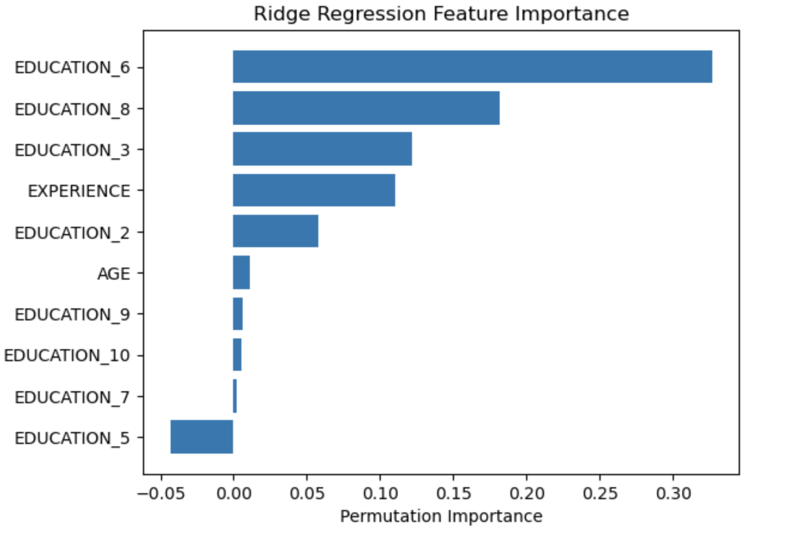
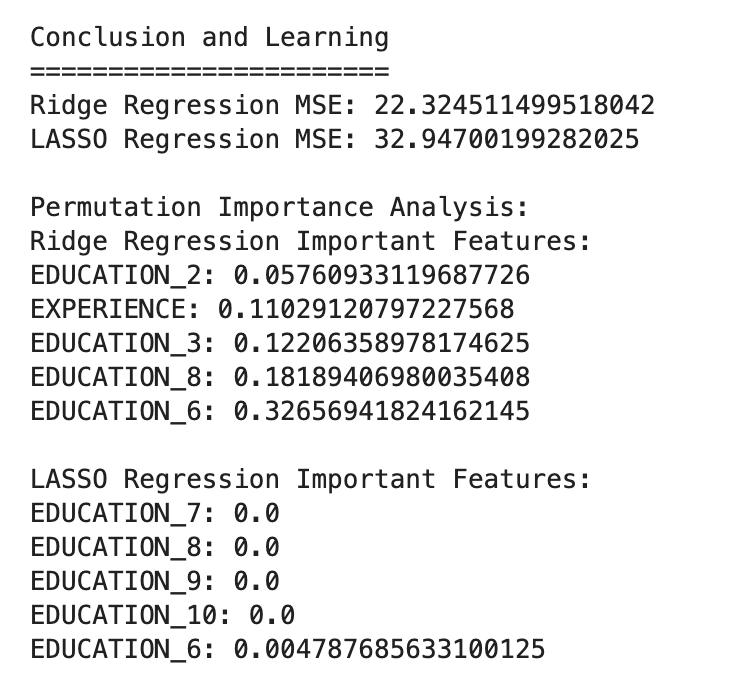

# Regularized Regression Models

This activity is meant to summarize the work with regularized regression models. 

We will build regression models to predict wage. Incorporate the categorical features and transform the target using a logarithm.  We will also Build ridge models and consider different amounts of regularization. After fitting the model, we will interpret it and try to understand what features led to higher wages.

We will use the sklearn data set.

wages = fetch_openml(data_id=534, as_frame=True)

# Summary of Steps Followed

1. Load the Dataset: The dataset was loaded from OpenML using fetch_openml.
2. Preprocess the Data: Defined numerical and categorical features, and used ColumnTransformer to apply StandardScaler to numerical features and OneHotEncoder to categorical features.
3. Split the Data: Split the dataset into training and testing sets.
4. Define Pipelines: Created pipelines for Ridge and Lasso regression models, including preprocessing steps.
5. Transform the Target Variable: Used TransformedTargetRegressor to apply a logarithmic transformation to the target variable.
6. Perform Grid Search: Used GridSearchCV to find the best hyperparameters for both Ridge and Lasso regression models.
7. Evaluate the Models: Predicted and evaluated the models using Mean Squared Error (MSE).
8. Permutation Importance: Used permutation_importance to analyze the importance of different features.
9. Plot Feature Importance: Plotted the feature importance for both Ridge and Lasso regression models.
10. Conclusion and Learning: Summarized the findings and key learning points.

# Learning and Conclusion

## Regularization:

Both Ridge and LASSO regression apply regularization to prevent overfitting.
Ridge regression tends to shrink coefficients towards zero, while LASSO regression can set some coefficients to zero, effectively performing feature selection.

## Log Transformation:

Transforming the target variable (wage) using a logarithm helps stabilize variance and make the data more normally distributed, improving model performance.

## Feature Importance:

Permutation importance provides insights into which features are most influential in predicting wages.
Features such as education and occupation have significant importance.
Model Comparison:

Ridge regression had a lower MSE compared to LASSO regression in this case, indicating it might be a better fit for this dataset.
Ridge Regression MSE: 22.324511499518042
LASSO Regression MSE: 32.94700199282025

